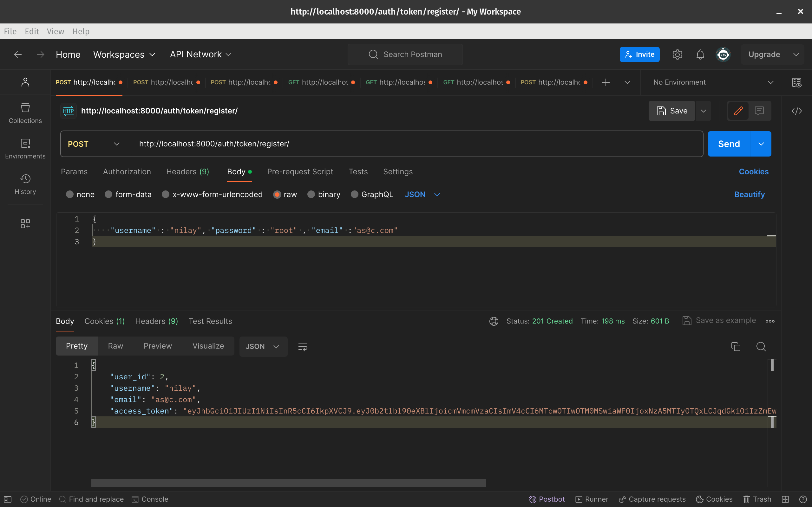
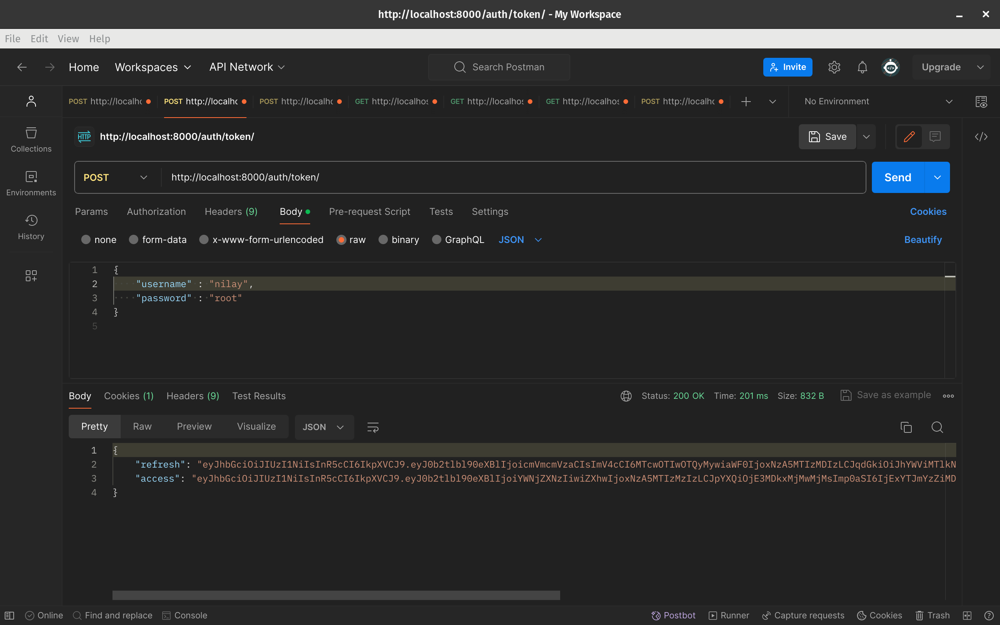
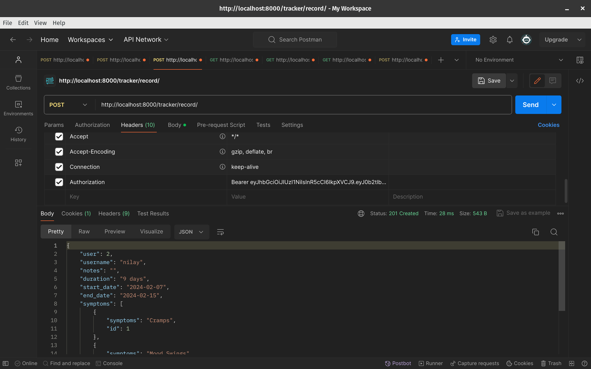
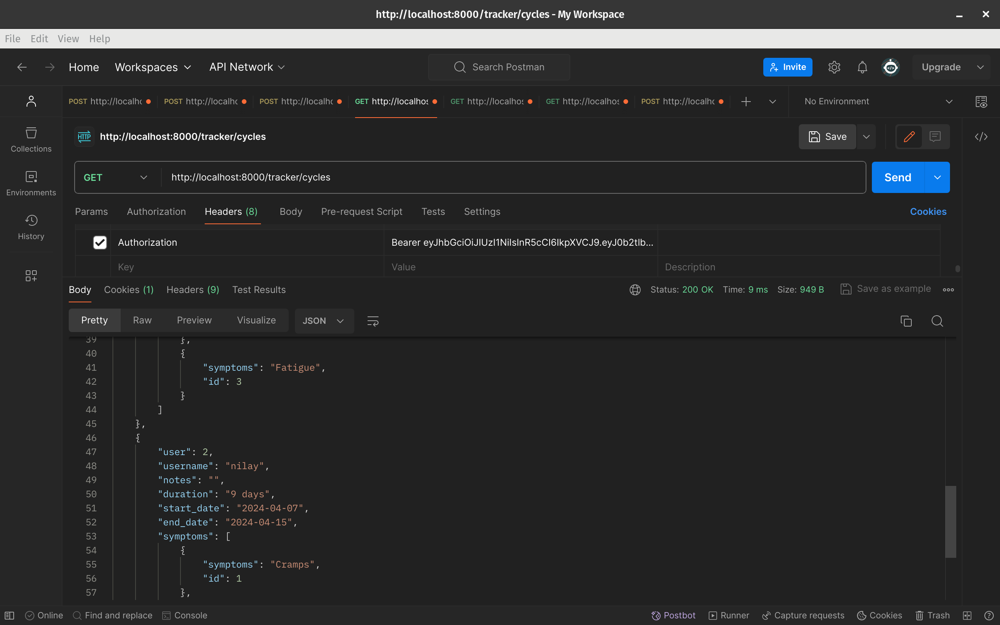
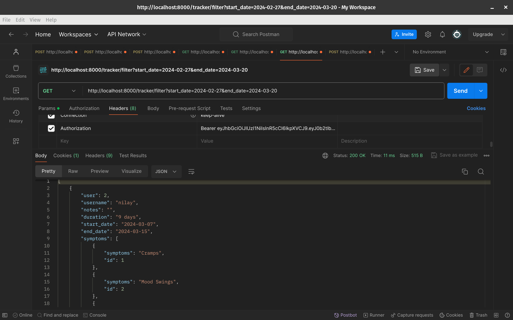
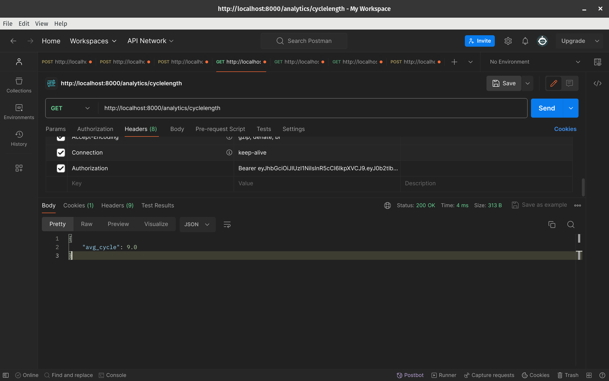
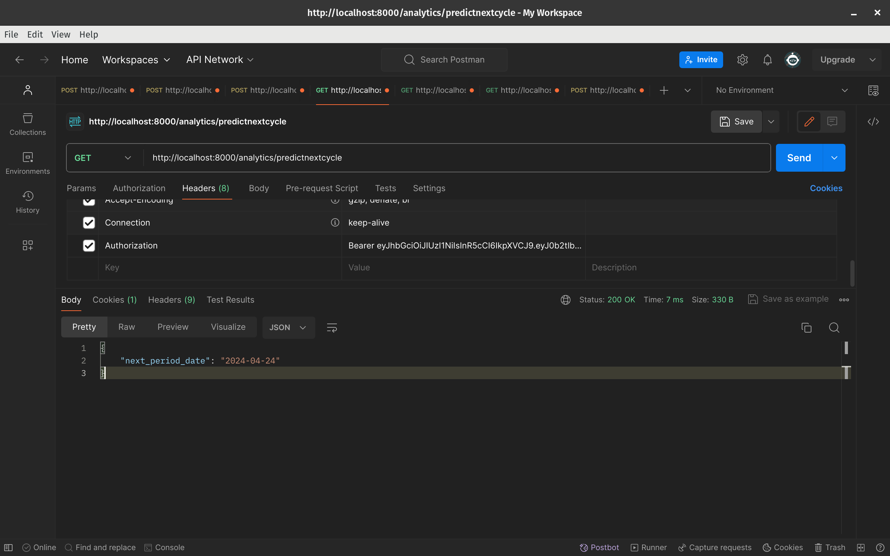
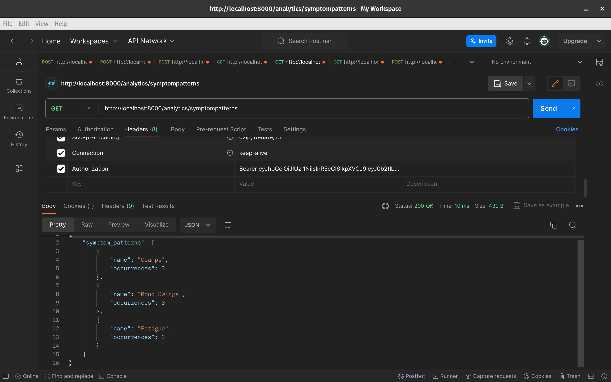
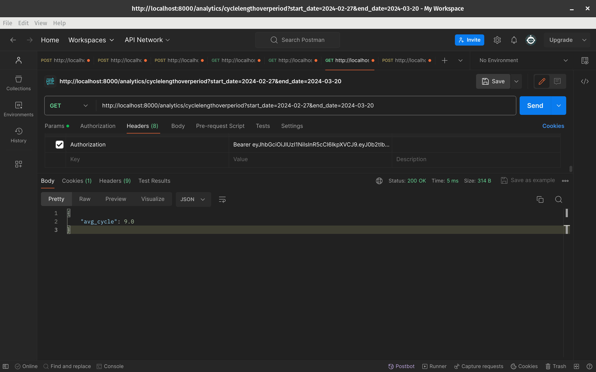

[![Issues][issues-shield]][issues-url]

<!-- PROJECT LOGO -->

  <h3 align="center">Period Tracker</h3>

  <p align="center">
    A backend system for a period tracking application. The application should allow users to track their menstrual cycles, including recording period start and end dates, symptoms, and other relevant informationDESCRIPTION
    <br />
    <a href="https://github.com/substantialcattle5/Period_Tracking"><strong>Explore the docs »</strong></a>
    <br />
    <br />
    <a href="https://github.com/substantialcattle5/Period_Tracking">View Demo</a>
    ·
    <a href="https://github.com/substantialcattle5/Period_Tracking/issues">Report Bug</a>
    ·
    <a href="https://github.com/substantialcattle5/Period_Tracking/issues">Request Feature</a>
  </p>
</p>

<!-- TABLE OF CONTENTS -->

## Table of Contents

- [About the Project](#about-the-project)
  - [Built With](#built-with)
- [Getting Started](#getting-started)
  - [Prerequisites](#prerequisites)
  - [Installation](#installation)
- [Usage](#usage)
- [Roadmap](#roadmap)
- [Contributing](#contributing)
- [License](#license)
- [Contributors](#contributors-)

<!-- ABOUT THE PROJECT -->

## About The Project

### Built With

- [Django]()
- [Python]()

<!-- GETTING STARTED -->

## Getting Started

To get a local copy up and running follow these simple steps.

### Prerequisites

This is an example of how to list things you need to use the software and how to install them.

- Python

```sh
sudo apt-get update
sudo apt-get install python3.6
```

### Installation

1. Clone the repo

```sh
git clone https://github.com/substantialcattle5/Period_Tracking.git
```

2. Install Required packages

```sh
python install -r requirements.txt
```

3. Run the project

```sh
python manage.py makemigrations
python manage.py migrate
python manage.py runserver

```

<!-- USAGE EXAMPLES -->

## Usage

### Authentication

Authentication is being done through jwt tokens.

1. Sign up



2. Login
   

### Period Tracking

1. Recording a Period
   
2. All the Period Cycles a user had
   
3. Period Cycles based on a date range
   

### Analytics

1. Length of average cycle
   
2. Predict the Next Cycle
   
3. Symptom Patterns
   
4. Average Cycle over a period
   

<!-- ROADMAP -->

## Roadmap

See the [open issues](https://github.com/substantialcattle5/Period_Tracking/issues) for a list of proposed features (and known issues).

<!-- CONTRIBUTING -->

## Contributing

Contributions are what make the open source community such an amazing place to be learn, inspire, and create. Any contributions you make are **greatly appreciated**.

1. Fork the Project
2. Create your Feature Branch (`git checkout -b feature/AmazingFeature`)
3. Commit your Changes (`git commit -m 'feat: Add some AmazingFeature'`)
4. Push to the Branch (`git push -u origin feature/AmazingFeature`)
5. Open a Pull Request

You are requested to follow the contribution guidelines specified in [CONTRIBUTING.md](./CONTRIBUTING.md) while contributing to the project :smile:.

<!-- LICENSE -->

## License

Distributed under the MIT License. See [`LICENSE`](./LICENSE) for more information.

<!-- MARKDOWN LINKS & IMAGES -->
<!-- https://www.markdownguide.org/basic-syntax/#reference-style-links -->

[csivitu-shield]: https://img.shields.io/badge/csivitu-csivitu-blue
[csivitu-url]: https://csivit.com
[issues-shield]: https://img.shields.io/github/issues/substantialcattle5/Period_Tracking.svg?style=flat-square
[issues-url]: https://github.com/substantialcattle5/Period_Tracking/issues
